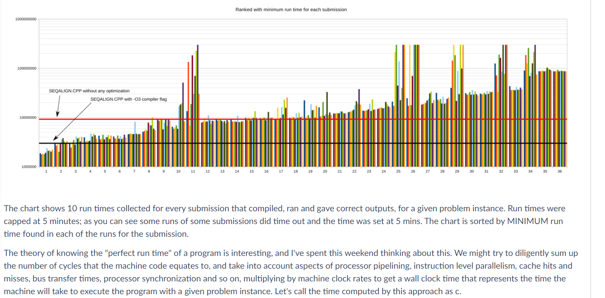

# sequence-alignment-openMP
COMP90025 - Parallel and Multicore Computing - 2020S2 - Assignment2A

## submit
- ```cd submit```
- ```/data/gpfs/projects/punim0520/pmc/pub/bin/handin seqalignomp xuliny-seqalignomp.cpp```

## result
- 
- 
### class ranking distribution
- 
- 
- 
- 

## how to run
### windows
#### sequential
- ```g++ -std=c++14 seqalign.cpp -o sequential```
- ```sequential.exe < seq.dat```

#### openMP
- ```g++ -fopenmp -std=c++14 seqalign_parallel.cpp -o parallel```
- ```parallel.exe < seq.dat```

### spartan
- ```sbatch sequential.slurm``` 
- ```sbatch parallel.slurm```

#### see jobs under execution
- ```squeue -u xuliny```

#### Spartan Weather Report
- ```spartan-weather```

## self test
- ```parallel7.exe < easy.dat > parallel_easy.txt```
- ```sequential.exe < easy.dat > sequential_easy.txt```
- ```parallel7.exe < medium.dat > parallel_medium.txt```
- ```sequential.exe < medium.dat > sequential_medium.txt```
- ```parallel7.exe < hard.dat > parallel_hard.txt```
- ```sequential.exe < hard.dat > sequential_hard.txt```